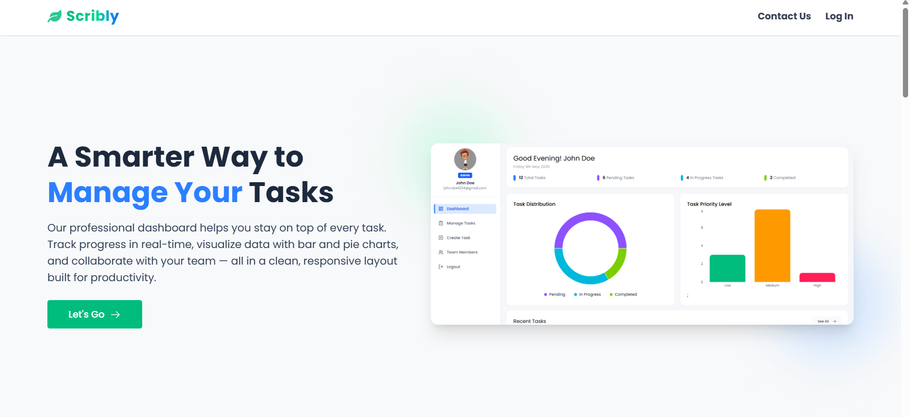
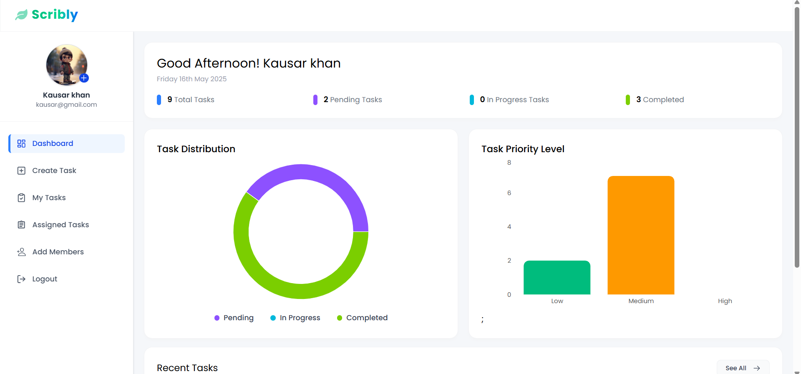
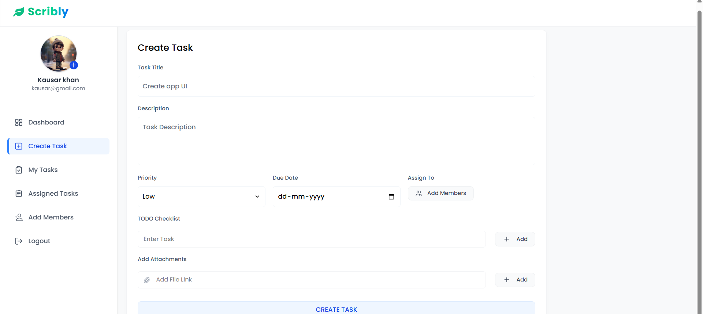
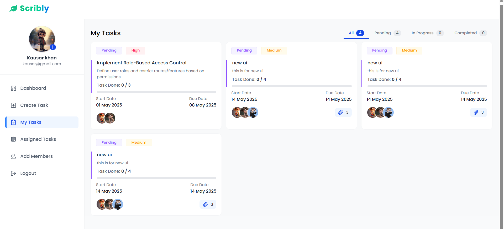
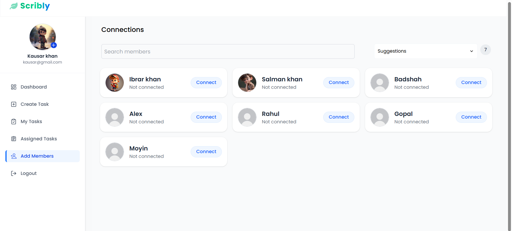
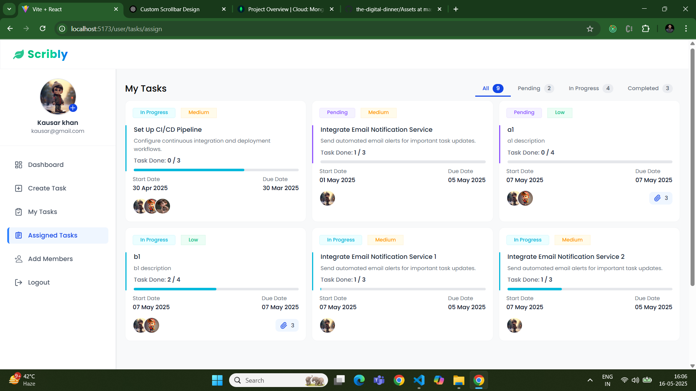

<h1 align="center">📓 Scribly - Your Smart Notes & Task Dashboard</h1>

<i>Write. Organize. Own your productivity — with Scribly.</i>

  <a href="https://scribly-azure.vercel.app" target="_blank">
    🔗 <strong>Live Demo</strong>
  </a>

---

## ✨ What is Scribly?

**Scribly** is a modern, responsive, and feature-rich **Notes & Task Management Dashboard** that empowers users to securely create, edit, organize, and manage their daily notes and to-dos.

> 🔤 **Name Meaning**:  
> "Scribly" is inspired by the word **"scribble"**, which reflects quickly jotting down ideas, reminders, or plans. The "-ly" suffix gives it a **modern, tech-savvy** flair — perfect for a smart productivity app.

---

## 🌟 UI Previews

### 🏠 Home Page  

### 🏠 Dashboard Overview  

### 🔐 Create Task  

### 📋 Task Management  

### 📝 Suggestions  

### 🤝 Admin Assigned Tasks  

---

## 🔗 User Connections System

Scribly includes a **social connection system** that enables users to connect, engage, and grow their productivity network within the platform.

**Key Features:**

- ✅ Users can **follow other users** to initiate a connection.
- 🔄 Follow requests can be **accepted or rejected** by the receiving user.
- 💡 Discover new people through **suggested users** (unknown/non-connected members).
- 📥 View all **incoming requests** from other users.
- 📤 Track all **sent connection requests** made by the user.
- ⏳ Monitor **pending connection requests** waiting for approval.
- 🤝 See a list of **established connections (members)**.
- 🔁 All statuses are **dynamic** and update in real-time.
- 🎞️ Smooth transitions and state changes powered by **Framer Motion**.
- ✨ Beautiful **shimmer loading UI** for seamless user experience during data fetch.

---

## 🧩 Tech Stack Overview

### 🎨 Frontend – `client/`

> Built with performance, responsiveness, and animation in mind.

| Technology          | Purpose                           |
| ------------------- | --------------------------------- |
| **React.js**        | Component-based UI                |
| **Tailwind CSS**    | Utility-first responsive styling  |
| **Framer Motion**   | Smooth animations & transitions   |
| **Axios**           | HTTP requests to backend          |
| **React Router**    | Page routing and navigation       |
| **Dark Mode**       | Theme toggle with modern UI       |
| **Drag & Drop API** | Task reordering experience        |
| **Form Validation** | Real-time error feedback in forms |

---

### 🔧 Backend – `server/`

> Focused on security, performance, and scalability.

| Technology             | Purpose                                    |
| ---------------------- | ------------------------------------------ |
| **Node.js + Express**  | Server and routing logic                   |
| **MongoDB + Mongoose** | Database and schema modeling               |
| **JWT Auth**           | Secured authentication using tokens        |
| **Bcrypt.js**          | Password hashing                           |
| **Cookie-parser**      | Session management using HTTP-only cookies |
| **CORS**               | Secure cross-origin requests               |
| **Express Middleware** | Route protection and error handling        |

---

## 📁 Folder Structure